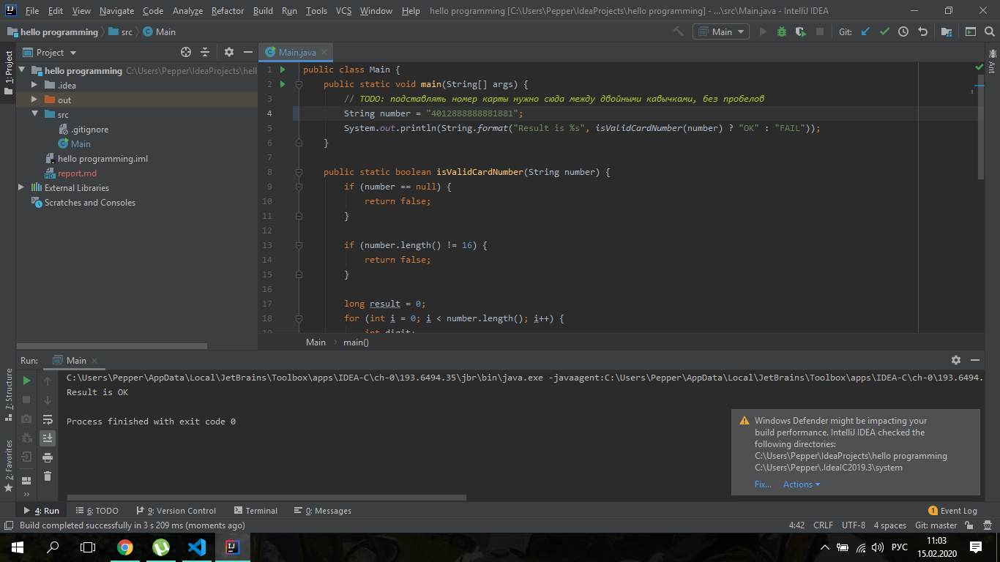
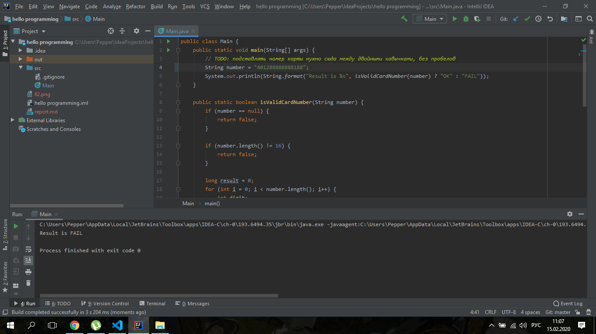

# Отчёт о тестировании <IntelliJ IDEA>

## Краткое описание

14.02.2020 было проведено тестирование эквивалентных значений, тестирование пограничных значений с созданием позитивных и негативных кейсов приложения IntelliJ IDEA.

На тестирование затрачено: 0,5 часа.

В результате тестирования дефекты не выявлены. 

## Описание процесса тестирования

В процессе тестирования использовались следующие артефакты:
1. Позитивные тестовые случаи:
* Ввод 16 цифр, соответствующих номерам карт Visa, Master Card, Мир в поле ввода "номер карты".
2. Негативные тестовые случаи:
* Ввод 1, 15 и 17 цифр в поле ввода "номер карты".
* Ввод пустого поля.
* Ввод пробелов.
* Ввод цифр 0.
* Ввод буквенных символов.
* Ввод произвольного набора цифровых символов.
* Ввод цифоровых символов в сочетании со знаком "-".

В качестве тестовых данных использовались данные [Инструкция по установке IntelliJ IDEA](https://github.com/netology-code/javaqa-homeworks/blob/master/intro/idea.md):
* После введения 16 цифр, соответствующих номерам карт Visa, Master Card, Мир в поле ввода "номер карты" выводится сообщение: "Ок". 
* После проведения негативных тестовых случаев выводится сообщение: "Fail".  

Тестирование производилось в следующем окружении:
* Windows 10 x64
* jdk-11.0.6.10.

